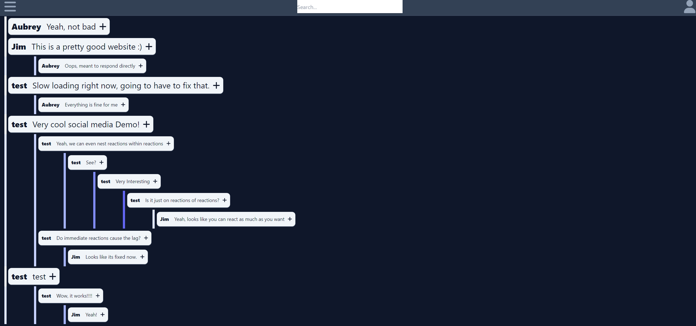

  
  # Social Media Demo

  ## Description

This project originated from a social media API assignment during a bootcamp and was fueled by my enthusiasm for implementing a sophisticated backend alongside a React/TypeScript frontend. The project showcases the foundation for a scrollable chatroom with seamless database integration, utilizing React to deliver an outstanding user experience.

  ## Table of Contents

  - [Installation](#installation)
  - [Usage](#usage)
  - [License](#license)
  - [Questions](#questions)

  ## Installation

  npm i - npm run dev

  ## Usage

  Just follow the link: https://social-media-demonstration.herokuapp.com/
  

  ## License

  This application is covered under the MIT license. Read more at [License: MIT](https://opensource.org/licenses/MIT)

  ## Questions

  1. Where can I find your github so that I can view your other projects? https://github.com/scicluna

  2. What email address should I use to contact you regarding further opportunities or questions? sciclunajl@gmail.com
